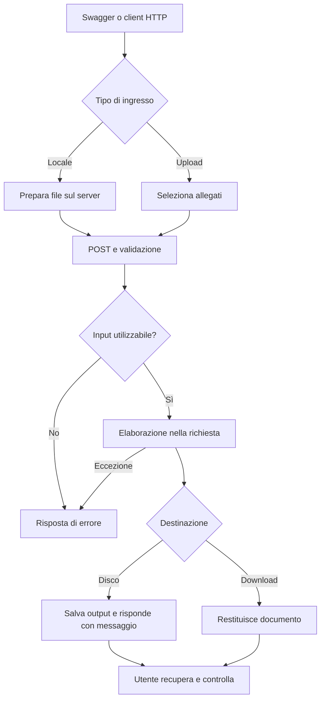

# Flussi operativi — AppFileTextProcessor

[README](README.md) · [Controller](AppFileTextProcessor/Controllers) · [Servizi](AppFileTextProcessor/Services)

## Ambito e punti di ingresso

Analisi dei sorgenti disponibili il 8 ottobre 2026, senza elaborare documenti reali. Il punto di ingresso è **Swagger alla radice dell'applicazione** oppure un client HTTP. Tutte le operazioni sotto usano POST.

Ci sono due cicli distinti:

- **File locali sul server:** l'utente prepara l'input nella directory `FILE_PROCESSOR_DIRECTORY` (fallback: `data` sotto `AppContext.BaseDirectory`). La risposta HTTP è un messaggio; l'output resta su disco sul server.
- **Upload:** l'utente sceglie i file in Swagger oppure invia multipart/form-data. La risposta contiene il documento scaricabile, elaborato in memoria.

Non c'è una coda di job: i controller completano l'elaborazione prima di restituire la risposta. Un metodo `async` non implica che il lavoro prosegua dopo la risposta.

## Conversioni di file locali

| Operazione e richiesta | Input e azione iniziale | Elaborazione automatica | Risposta e output |
| --- | --- | --- | --- |
| `/api/AppTextConvert/process?outputFileName=...` | Preparare APP_INIZIALE.txt e indicare il nome output senza estensione | Legge UTF-8; normalizza testo, crea sezioni per anno, elimina alcune righe tecniche, riconosce comuni e CF/P.IVA; cerca denominazioni SQL prima nel tenant A poi nel B se non trovate | 200 con messaggio; salva nome scelto + .txt |
| `/api/MimTextToExcel/process` | Preparare MIM_INIZIALE.txt | Legge ISO-8859-1; riconosce inizio record e accumula l'esito fino al record successivo; esporta Protocollo, Identificativo, ESITO | 200 con messaggio; MIM_FINALE.xlsx |
| `/api/VsaTextToExcel/process` | Preparare VSA_INIZIALE.txt | Stesso parser testuale e stesso servizio di esportazione di MIM | 200 con messaggio; VSA_FINALE.xlsx |
| `/api/VsaMassExcel/process` | Preparare VSA_MASS.xlsx con il tracciato atteso | Legge il primo foglio, costruisce un esito descrittivo per riga, include il rappresentante quando le colonne 21–36 non sono tutte vuote | 200 con messaggio; VSA_MASS_FINALE.xlsx |
| `/api/PhoneNumberProcessor/process?inputFileName=...&outputFileName=...` | Preparare input .xlsx e indicare entrambi i nomi senza estensione | Legge Foglio1, colonna 22; separa numeri per spazio/virgola, deduplica, classifica per prefisso 0 o 3 e scrive le colonne 22–25 | 200 con messaggio; nome output + .xls |

**Ciclo dell'utente:** prepara input → esegue POST → attende → legge il messaggio → recupera l'output dalla cartella server → controlla il contenuto. Non è previsto un download HTTP per queste cinque operazioni.

Riferimenti: [APP](AppFileTextProcessor/Controllers/AppTextConverterController.cs), [MIM](AppFileTextProcessor/Controllers/MimTextToExcelController.cs), [VSA](AppFileTextProcessor/Controllers/VsaTextToExcelController.cs), [VSA massivo](AppFileTextProcessor/Controllers/VsaMassExcelController.cs), [telefoni](AppFileTextProcessor/Controllers/PhoneNumberProcessorController.cs).

### Regole che cambiano il risultato

- Il parser MIM/VSA riconosce protocolli che iniziano con **l'anno corrente del server seguito da sette cifre**. Testi con altri anni possono produrre un output senza i record attesi, pur con risposta 200.
- APP cerca denominazioni nelle pratiche con anni **2014–2024**. Se non trova la denominazione, conserva l'identificativo tra parentesi.
- Nei telefoni, vuoto o “NON RISALIBILE” produce quella dicitura in colonna 22 e svuota le altre tre. La classificazione è per prefisso; non certifica la validità del numero. La seconda posizione di ogni tipo viene sovrascritta da ulteriori numeri dello stesso tipo.
- L'output telefoni è denominato `.xls`, ma viene scritto tramite EPPlus: il nome non prova che sia un file binario legacy XLS.
- I nomi locali fissi possono sovrascrivere output precedenti. Non è implementato un archivio versionato o un rollback dei file.

## Upload Excel: unione, confronto e codice fiscale

L'utente apre l'endpoint, seleziona gli allegati richiesti e invia la richiesta. Il controller apre il primo foglio, applica le regole e restituisce un file. Dopo la risposta, l'utente salva il download e controlla il risultato; non parte un invio esterno.

| Endpoint e campi multipart | Passaggi di elaborazione | Risultato |
| --- | --- | --- |
| `/api/ExcelMerger/merge`: file1, file2 | Copia l'intestazione del primo file, accoda le righe dei due fogli e mescola le righe con Random | Download XLSX; ordine non stabile tra esecuzioni |
| `/api/MergerExcelFiles/merge`: fileTENANT_B, fileTENANT_A | Copia intestazione e numero di colonne da B, accoda prima B poi A, formatta e adatta larghezze | XLSX con nome derivato da B e dal totale righe |
| `/api/ConfrontaFile/confronta`: fileA, fileB | Indicizza B per CF in colonna 2, legge stato in 4 ed email in 5; cerca i CF di A in colonna 2 e aggiorna le colonne **50 (AX)** e **51 (AY)** | LISTA_NIS2_aggiornato.xlsx |
| `/api/CodiceFiscale/process`: file | Legge cognome, nome, sesso, data, luogo e provincia nelle prime sei colonne; calcola CF e carattere di controllo usando dizionari JSON geografici | Codici_Fiscali_Elaborati.xlsx; risultato in colonna 7 |

Il nome della route `MergerExcelFiles` deriva dalla classe, anche se il sorgente si chiama [MergeExcelFilesController.cs](AppFileTextProcessor/Controllers/MergeExcelFilesController.cs).

Nel confronto, CF ripetuti in B conservano l'ultima coppia stato/email; righe non corrispondenti di A restano invariate. Le lettere delle colonne nei commenti del codice non corrispondono agli indici: il flusso sopra usa gli indici realmente eseguiti.

Nel calcolo CF, una data non leggibile come `dd/MM/yyyy` produce un messaggio nella cella e la lavorazione continua sulle altre righe; un luogo non trovato produce “Comune non trovato”. La risposta può quindi essere 200 con errori per riga. Il parametro provincia viene letto, ma la ricerca catastale implementata usa il nome del luogo. Non c'è una verifica presso un servizio anagrafico esterno.

Riferimenti: [unione mescolata](AppFileTextProcessor/Controllers/ExcelMergerController.cs), [unione tenant](AppFileTextProcessor/Controllers/MergeExcelFilesController.cs), [confronto](AppFileTextProcessor/Controllers/ConfrontaFileController.cs), [CF](AppFileTextProcessor/Controllers/CodiceFiscaleController.cs).

## Upload PDF

1. L'utente seleziona un PDF nel campo `File` di `POST /api/PdfProcessing/replace-logo`.
2. Il controller rifiuta file assente o vuoto con 400.
3. Copia l'upload in memoria e chiama `PdfProcessingService.ReplaceLogo`.
4. Il servizio apre il PDF e carica il logo locale configurato in `Branding:LogoPath`.
5. Ridimensiona il logo a larghezza 150 e lo sovrappone in alto a destra di ogni pagina, con margine 25.
6. Chiude il documento e restituisce i byte; il controller risponde con `modified.pdf`.
7. L'utente scarica e verifica tutte le pagine.

**Comportamento reale:** il logo è sovrapposto; il contenuto originale sottostante non viene rimosso. Logo mancante, PDF non leggibile o errore di elaborazione producono 500. Riferimenti: [controller PDF](AppFileTextProcessor/Controllers/PdfprocessingController.cs), [servizio PDF](AppFileTextProcessor/Services/PdfProcessingService.cs).

## Diagramma dei due cicli

## Errori e ripetizione

| Evento | Esito osservabile |
| --- | --- |
| Input locale mancante | 400 nelle conversioni APP/MIM/VSA/massivo; 404 nei telefoni |
| Nomi query richiesti assenti | 400 |
| Allegati assenti | 400; i controlli su file vuoti variano tra controller |
| Foglio, tracciato, JSON, logo o connessione SQL non utilizzabile | Eccezione; in genere 500 dal controller. Errori durante la costruzione delle dipendenze possono avvenire prima del suo try/catch |
| Operazione completata | 200 con messaggio o file, secondo la tabella |
| Ripetizione | Ricalcola il risultato; nei file locali può sovrascrivere l'output, nell'unione mescolata può cambiare l'ordine |

Non è previsto un tentativo automatico applicativo dopo un errore. Un 200 conferma il completamento del codice, non la correttezza semantica del tracciato.

## Automazioni e attività dopo la risposta

Le trasformazioni, le ricerche SQL, la scelta dei dizionari, il calcolo e la generazione file sono automatici **dentro la richiesta**. Logging Serilog registra l'attività. `AtecoService` è presente e registrato, ma non risulta un endpoint dedicato né una chiamata ai suoi metodi nelle elaborazioni esaminate: non va presentato come flusso utente attivo.

Non risultano scheduler, watcher, notifiche email, code persistenti, trasferimenti automatici o workflow GitHub Actions. Dopo la risposta non resta un job di elaborazione attivo.

## Verifica manuale suggerita

Per ciascun endpoint provare un input conforme, un input assente e un tracciato non conforme. Per i locali controllare il file sul server; per gli upload aprire il download. Verificare in particolare anno dei protocolli MIM/VSA, colonne AX/AY del confronto, errori per riga del CF, sovrapposizione PDF e ripetizione su un output locale esistente.
